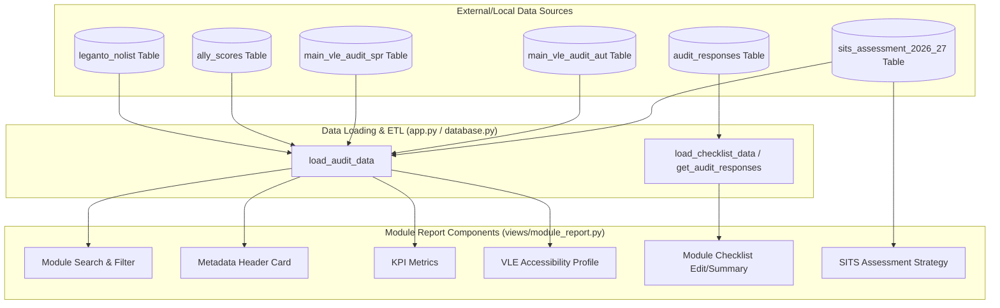

# VLE Digital Learning Review - Module Report Card Component Documentation

This document lists all components of the **Module Report Card** view rendered by [views/module_report.py](file:///c:/Users/fs1hpc/Documents/GitHub/Digital-Learning-Review/views/module_report.py), detailing their purpose, data sources, derivation logic, and relevant code references.

---

## 📊 Component & Data Source Summary

| Component | Purpose | Primary Data Sources | Derivation & Logic |
| :--- | :--- | :--- | :--- |
| **1. Module Selector & Search** | Allows users to search and select a module code/name. | SITS Assessment / Legacy Audits | Combines codes and names from active semesters; filters options based on user capability locks. |
| **2. Metadata Header Card** | Displays key metadata (Module Lead, Programme Lead, Level, VLE Link). | SITS Assessment / Legacy Audits | Extracts information from active semester rows; formats lead names using custom title-casing. |
| **3. KPI Metrics** | Displays status metrics for Leganto connection and audit checklist. | Leganto Lists / SQLite Responses | Checks for missing reading lists and queries checklist submission completion. |
| **4. VLE Accessibility (Ally)** | Visual representation of accessibility score, progress, and files scanned. | Ally Accessibility Scores | Color-codes and categorizes scores into 4 tiers with warning banners for low file counts. |
| **5. Module Checklist** | Form for editing checklist (Admins) or view-only summary (Standard Users). | SQLite `audit_responses` / `audit_fields` | Fetches active fields from DB, maps boolean checkbox status, tag inputs, and text comments. |
| **6. SITS Assessment Strategy** | Visual grid of assessments, weightings, and requirements. | SQLite `sits_assessment_2026_27` | Renders individual assessment components, weightings, final assessment flags, and duration. |

---

## 🗺️ Architectural Data Flow

---

## 🔍 Detailed Component Analysis

### 1. Module Selector & Search Component
* **Purpose**: Provides a unified dropdown search list where users can select a module.
* **UI Elements**: Streamlit `st.selectbox` dropdown titled *"Search by Module Code or Name"*.
* **Data Origin**:
  - `module_mapping = get_module_mapping(df_aut, df_spr)` defined in [processing.py](file:///c:/Users/fs1hpc/Documents/GitHub/Digital-Learning-Review/processing.py#L71-L88).
  - Formatted as `"{module_code} - {module_name}"` and sorted alphabetically.
* **Derivation & Access Rules**:
  - Checks if the user's role is school-restricted via `st.session_state.get("capabilities", [])`.
  - If the user has `"view only own school"`, the selection options are constrained to only match `st.session_state.saved_school`.
  - If the user has administrative/faculty visibility, they can filter by any school or choose to uncheck the school context focus to search other schools.
* **Code Reference**: [views/module_report.py:L44-L105](file:///c:/Users/fs1hpc/Documents/GitHub/Digital-Learning-Review/views/module_report.py#L44-L105)

### 2. Overview Metadata Header Card
* **Purpose**: Displays high-level contact details, level, and link for the selected module.
* **UI Elements**: 4 columns inside an `st.container(border=True)`.
* **Data Origin**:
  - The module's active row is extracted by prioritizing Spring (`df_spr`) then falling back to Autumn (`df_aut`) matching the selected module code.
* **Derivation Logic**:
  - **Module Lead (`mod_lead`)**: Derived from the row's `'Mod. lead'` column. If absent or `'nan'`, displays `"*Not Specified*"`. Raw names are processed via `title_case_name()` to convert uppercase SITS details into clean Title Case (handles hyphens, `Mc`, `O'`, `D'`, `L'`).
  - **Programme Lead (`prog_lead`)**: Derived from the row's `'Prog. lead'` column and title-cased.
  - **Level (`ug_pg`)**: Derived from `'UG/ PG/ Other'` (mapped in [app.py](file:///c:/Users/fs1hpc/Documents/GitHub/Digital-Learning-Review/app.py) from raw SITS integer/char level codes to clean labels like `UG Level 1`, `PGT`, etc.).
  - **VLE Link (`url`)**: Extracted from `'URL'`. If populated, renders as a button link `[Open Module Site 🌐]({url})`.
* **Code Reference**: [views/module_report.py:L110-L157](file:///c:/Users/fs1hpc/Documents/GitHub/Digital-Learning-Review/views/module_report.py#L110-L157)
### 3. Key Performance Indicators (KPI) Metrics
* **Purpose**: Displays connectivity statuses for external curriculum tools (Leganto reading list and audit checklist submission).
* **UI Elements**: `st.metric` widgets showing active statuses.
* **Data Origin**:
  - **Leganto Status**: Read from the `'Leganto Missing'` column of `df_aut`/`df_spr` loaded from the SQLite `leganto_nolist` table.
  - **Checklist Status**: Derived from the checklist aggregation dictionary `checklist_sums` passed from `app.py`.
* **Derivation Logic**:
  - **Leganto Reading List**: If the module has `'Leganto Missing'` flagged as `True` in either semester, displays `❌ Missing List` and renders a red action warning (`st.error`). Otherwise, displays `✅ OK / Connected`.
  - **Checklist Status**: Fetches `'Status'` from `checklist_sums` for the module code (displays `❌ No Submission` or the checklist status).
* **Code Reference**: [views/module_report.py:L158-L195](file:///c:/Users/fs1hpc/Documents/GitHub/Digital-Learning-Review/views/module_report.py#L158-L195)

### 4. VLE Accessibility Profile (Ally) Card
* **Purpose**: Displays the parsed accessibility health score and volume of content scanned by Blackboard Ally.
* **UI Elements**: Colored score tier card, progress bar (`st.progress`), and file counts metric.
* **Data Origin**:
  - **Ally Score (`ally_score`)**: Resolves active row columns in priority: `'Ally 25/26 All'` ➔ `'Ally Weighted'` ➔ `'Ally Measured'`.
  - **Total Files (`ally_files`)**: Prioritizes `'Total Files'` ➔ `'Ally 25/26 Files'`.
* **Derivation Logic**:
  - Score value is mapped into official Blackboard Ally tiers:
    - **Perfect** ($\ge 100\%$): Dark Green (`#047857`) - *"Perfect! No accessibility issues were found by the tool."*
    - **High** ($67\% \le \text{Score} < 100\%$): Light Green (`#10B981`) - *"Almost there. The file is mostly accessible, but minor improvements are still possible."*
    - **Medium** ($34\% \le \text{Score} < 67\%$): Amber/Orange (`#F59E0B`) - *"A little better. The file is somewhat accessible and needs improvement."*
    - **Low** ($< 34\%$): Red (`#EF4444`) - *"Needs help! The file has severe or multiple accessibility issues."*
  - **Low Content Warnings**: If `files_val == 0`, a warning banner informs that the score is unverified due to lack of uploads. If `files_val < 5`, an info banner is displayed stating that the score may skew due to low content.
* **Code Reference**: [views/module_report.py:L197-L251](file:///c:/Users/fs1hpc/Documents/GitHub/Digital-Learning-Review/views/module_report.py#L197-L251)

### 5. Module Checklist Section
* **Purpose**: Shows the audit checklist fields and allows elevated users to submit updates.
* **UI Elements**: Expandable form (`st.form`) for DLAs/Admins, or read-only markdown summaries for standard users.
* **Data Origin**:
  - **Active fields**: `get_active_audit_fields()` in [database.py](file:///c:/Users/fs1hpc/Documents/GitHub/Digital-Learning-Review/database.py#L225-L230).
  - **Checklist responses**: `get_audit_responses(selected_code)` in [database.py](file:///c:/Users/fs1hpc/Documents/GitHub/Digital-Learning-Review/database.py#L320-L330).
  - **Standard comments**: `get_comment_bank()` in [database.py](file:///c:/Users/fs1hpc/Documents/GitHub/Digital-Learning-Review/database.py#L488-L491).
* **Derivation & Processing**:
  - **Elevated users (DLA/ADMIN)**: Renders a form where boolean fields are checkboxes (`st.checkbox`) and text fields have both comment bank tags (`st.multiselect`) and custom text areas (`st.text_area`). On submission, updates module lead in SITS/legacy sqlite tables via `update_module_lead_sqlite()` and saves field values to `audit_responses` using `save_audit_response()`. Clears Streamlit cache to force immediate data reload.
  - **Standard users**: Renders a read-only list showing ✅/❌ for boolean items, tags formatted inside styled HTML pills, and raw text comments.
* **Code Reference**: [views/module_report.py:L254-L407](file:///c:/Users/fs1hpc/Documents/GitHub/Digital-Learning-Review/views/module_report.py#L254-L407)

### 6. SITS Assessment Strategy Section
* **Purpose**: Gives visibility into assessment structures, weights, and expectations for the module.
* **UI Elements**: Expandable grid card layout mapping out components.
* **Data Origin**:
  - Loaded from `df_assess` (populated from SITS tables in SQLite database).
* **Derivation Logic**:
  - Extracts rows matching the selected CIS unit code.
  - Displays a columns layout mapping out:
    - **Weighting**: `Assessment weighting` column (e.g. `100%`).
    - **Assessment Type**: `Assessment type` column (e.g. `Exam`, `Coursework`).
    - **Details**:
      - Word Count: `Word Count` field (e.g. `2000 words`).
      - Exam Duration: `Exam duration (per hour)` field (e.g. `2 hours`).
      - Final Flag: `Final assessment flag` (renders 🏁 Final Component if 'yes').
      - Reassessment format: `Reassessment` field.
      - Qualifying Mark: `Qualifying mark` field.
* **Code Reference**: [views/module_report.py:L408-L448](file:///c:/Users/fs1hpc/Documents/GitHub/Digital-Learning-Review/views/module_report.py#L408-L448)
