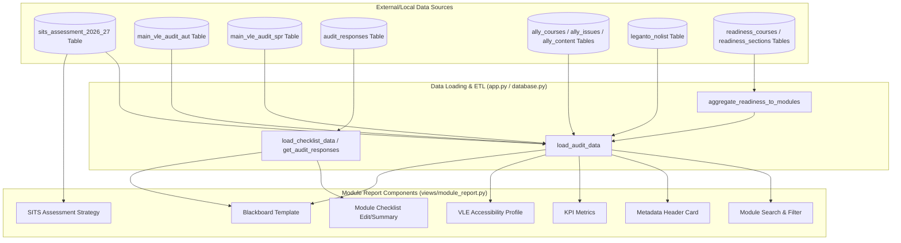

# VLE Digital Learning Review - Module Report Card Component Documentation

This document lists all components of the **Module Report Card** view rendered by [views/module_report.py](file:///c:/Users/fs1hpc/Documents/GitHub/Digital-Learning-Review/views/module_report.py), detailing their purpose, data sources, derivation logic, and relevant code references.

---

## 📊 Component & Data Source Summary

| Component | Purpose | Primary Data Sources | Derivation & Logic |
| :--- | :--- | :--- | :--- |
| **1. Module Selector & Search** | Allows users to search and select a module code/name. | SITS Assessment / Legacy Audits | Combines codes and names from active semesters; filters options based on user capability locks. |
| **2. Metadata Header Card** | Displays key metadata (Module Lead, Programme Lead, Level, VLE Link). | SITS Assessment / Legacy Audits | Extracts information from active semester rows; formats lead names using custom title-casing. |
| **3. KPI Metrics** | Displays status metrics for Leganto connection and audit checklist. | Leganto Lists / SQLite Responses | Checks for missing reading lists and queries checklist submission completion. |
| **4. VLE Accessibility (Ally)** | Visual representation of accessibility score, progress, and files scanned. | Ally Accessibility Scores | Color-codes and categorizes scores into 4 tiers with warning banners for low file counts. |
| **5. Module Checklist** | Form for editing checklist (Admins) or view-only summary (Standard Users). | SQLite `audit_responses` / `audit_fields` | Fetches active fields from DB, maps boolean checkbox status, tag inputs, and text comments. |
| **6. SITS Assessment Strategy** | Visual grid of assessments, weightings, and requirements. | SQLite `sits_assessment_2026_27` | Renders individual assessment components, weightings, final assessment flags, and duration. |
| **7. Blackboard Template** | Per-section readiness badges for the faculty Template Alignment Report — Visible to students / Visible, unedited / Hidden from students / Not started / Deleted / Missing. | SQLite `readiness_courses` / `readiness_sections`, mapped via `processing.TEMPLATE_SECTIONS` | Rendered by `_render_template_sections()` via the recursive `_render_section_tree()`; state per section from `processing.classify_section_state()` / `SECTION_STATES`, readiness from `readiness_section_is_ready()`. A real audit answer for the section's mapped checklist field overrides the data-driven badge (`readiness_manual_override()`). Sections nest to match the actual Blackboard Ultra course menu (`processing.TEMPLATE_SECTION_TREE`) rather than a lead-owned/other split - see §7a. |
| **7a. Template section nesting** | The 14 tracked sections plus 2 untracked Learning Module headings, laid out as a tree matching where a lead actually finds each item in their own course: **Module Information** (Learning Module) → Welcome & Module Outline, Key Staff Contacts, Skills Development (SGAs), Student Voice → *How Your Feedback Shapes This Module*, Accessibility Statement, School Handbook; **Module Reading List** and **Encore Lecture Capture** as standalone top-level items; **Learning Materials** (Learning Module, no readiness data tracked under it at all yet - rendered as a heading only, with a "not part of the readiness data yet" caption); **Assessment Information** (Learning Module, container itself untracked) → Assessment Overview, Assessment Detail, Assessment Support and Guidance; **University Help & Support** standalone. | `processing.TEMPLATE_SECTION_TREE` | `_render_section_tree()` recurses depth-first; a `('section', key, children)` node renders `_render_section_card()` (indented via `depth * 24px`) whenever `key` has data, independent of whether its parent did; a `('label', name, children)` node renders `_render_label_node()` - a heading with the Learning Module icon, never a status card, since there is no visibility state to show one for. |
| **8. Tabs & Data Reliability Block** | Accessibility Report and Module Checks and Readiness as two tabs (Module Checks first); a data-reliability block above both tabs shows each source's ingestion date and a collapsed rationale for automated vs manually-verified findings. | `active_row` (`Ally Last Checked`, `Readiness Snapshot`, `Leganto Snapshot`) | `st.tabs()` in `view_module_report()`; block rendered by `_render_data_reliability_block()`. |

---

## 🗺️ Architectural Data Flow

---

## 🔍 Detailed Component Analysis

### 1. Module Selector & Search Component
* **Purpose**: Provides a unified dropdown search list where users can select a module.
* **UI Elements**: Streamlit `st.selectbox` dropdown titled *"Search by Module Code or Name"*.
* **Data Origin**:
  - `module_mapping = get_module_mapping(df_aut, df_spr)` defined in [processing.py](file:///c:/Users/fs1hpc/Documents/GitHub/Digital-Learning-Review/processing.py#L71-L88).
  - Formatted as `"{module_code} - {module_name}"` and sorted alphabetically.
* **Derivation & Access Rules**:
  - Checks if the user's role is school-restricted via `st.session_state.get("capabilities", [])`.
  - If the user has `"view only own school"`, the selection options are constrained to only match `st.session_state.saved_school`.
  - If the user has administrative/faculty visibility, they can filter by any school or choose to uncheck the school context focus to search other schools.
* **Code Reference**: [views/module_report.py:L44-L105](file:///c:/Users/fs1hpc/Documents/GitHub/Digital-Learning-Review/views/module_report.py#L44-L105)

### 2. Overview Metadata Header Card
* **Purpose**: Displays high-level contact details, level, and link for the selected module.
* **UI Elements**: 4 columns inside an `st.container(border=True)`.
* **Data Origin**:
  - The module's active row is extracted by prioritizing Spring (`df_spr`) then falling back to Autumn (`df_aut`) matching the selected module code.
* **Derivation Logic**:
  - **Module Lead (`mod_lead`)**: Derived from the row's `'Mod. lead'` column. If absent or `'nan'`, displays `"*Not Specified*"`. Raw names are processed via `title_case_name()` to convert uppercase SITS details into clean Title Case (handles hyphens, `Mc`, `O'`, `D'`, `L'`).
  - **Programme Lead (`prog_lead`)**: Derived from the row's `'Prog. lead'` column and title-cased.
  - **Level (`ug_pg`)**: Derived from `'UG/ PG/ Other'` (mapped in [app.py](file:///c:/Users/fs1hpc/Documents/GitHub/Digital-Learning-Review/app.py) from raw SITS integer/char level codes to clean labels like `UG Level 1`, `PGT`, etc.).
  - **VLE Link (`url`)**: Extracted from `'URL'`. If populated, renders as a button link `[Open Module Site 🌐]({url})`.
* **Code Reference**: [views/module_report.py:L110-L157](file:///c:/Users/fs1hpc/Documents/GitHub/Digital-Learning-Review/views/module_report.py#L110-L157)
### 3. Key Performance Indicators (KPI) Metrics
* **Purpose**: Displays connectivity statuses for external curriculum tools (Leganto reading list and audit checklist submission).
* **UI Elements**: `st.metric` widgets showing active statuses.
* **Data Origin**:
  - **Leganto Status**: Read from the `'Leganto Missing'` column of `df_aut`/`df_spr` loaded from the SQLite `leganto_nolist` table.
  - **Checklist Status**: Derived from the checklist aggregation dictionary `checklist_sums` passed from `app.py`.
* **Derivation Logic**:
  - **Leganto Reading List**: If the module has `'Leganto Missing'` flagged as `True` in either semester, displays `❌ Missing List` and renders a red action warning (`st.error`). Otherwise, displays `✅ OK / Connected`.
  - **Checklist Status**: Fetches `'Status'` from `checklist_sums` for the module code (displays `❌ No Submission` or the checklist status).
* **Code Reference**: [views/module_report.py:L158-L195](file:///c:/Users/fs1hpc/Documents/GitHub/Digital-Learning-Review/views/module_report.py#L158-L195)

### 4. VLE Accessibility Profile (Ally) Card
* **Purpose**: Shows what Ally found in this course and what to do about it. Rendered by `_render_ally_card()`.
* **UI Elements**, in the order they appear:
  1. **Build-stage banner** — `'Content Maturity'`, one of *In progress*, *Not yet built*, *Empty*, *No data*. Placed above the scores deliberately: a rolled-over template scores near 100% and must not read as an accessibility result. There is deliberately no *Built*/*Complete* state — module leads add content just-in-time throughout the course, so a file count can only show a course has started, never that it is finished.
  2. **Three score tiles** — `'Ally Overall'`, `'Ally Files'`, `'Ally WYSIWYG'`, each captioned with the item count behind it.
  3. **Surface-gap caption** — shown when files and pages differ by 15 points or more, naming which side the work sits on.
  4. **"Fix these first"** — the module's non-zero issue rows from `ally_issues`, sorted severity then item count, each with a plain-English label, a fix-location tag and advice from `processing.ALLY_CHECKS`. Deep-links to the course in Blackboard.
  5. **Status strip** — students, course shells, whether Ally is enabled, and when Ally last scanned the course (per course, not per export).
  6. **Trend** — overall score across stored snapshots, shown only when the course has moved more than once.
* **Data Origin**: `ally_courses` / `ally_issues` for the current academic year, rolled up in `processing.aggregate_ally_to_modules()`; issue detail read from `st.session_state["df_ally_issues"]`.
* **Score bands** (`ALLY_BANDS`, matching Blackboard's own wording): **Perfect** ($=100\%$) `#047857`; **High** ($\ge 67\%$) `#10B981`; **Medium** ($\ge 34\%$) `#F59E0B`; **Low** `#EF4444`.
* **Issue severity**: `:1` severe, `:2` major, `:3` minor. `LibraryReference` carries no severity and is never counted as a defect.
* **Removed in v1.16.0**: the single credibility-weighted score, the asymptotic-credibility caption and the "fewer than 5 files" caveat. Item counts and the build-stage banner answer the same question directly, and the old model disagreed with the score module leads see in Blackboard.
* **Code Reference**: [views/module_report.py](file:///c:/Users/fs1hpc/Documents/GitHub/Digital-Learning-Review/views/module_report.py)

### 5. Module Checklist Section
* **Purpose**: Shows the audit checklist fields and allows elevated users to submit updates.
* **UI Elements**: Expandable form (`st.form`) for DLAs/Admins, or read-only markdown summaries for standard users.
* **Data Origin**:
  - **Active fields**: `get_active_audit_fields()` in [database.py](file:///c:/Users/fs1hpc/Documents/GitHub/Digital-Learning-Review/database.py#L225-L230).
  - **Checklist responses**: `get_audit_responses(selected_code)` in [database.py](file:///c:/Users/fs1hpc/Documents/GitHub/Digital-Learning-Review/database.py#L320-L330).
  - **Standard comments**: `get_comment_bank()` in [database.py](file:///c:/Users/fs1hpc/Documents/GitHub/Digital-Learning-Review/database.py#L488-L491).
* **Derivation & Processing**:
  - **Elevated users (DLA/ADMIN)**: Renders a form where boolean fields are checkboxes (`st.checkbox`) and text fields have both comment bank tags (`st.multiselect`) and custom text areas (`st.text_area`). On submission, updates module lead in SITS/legacy sqlite tables via `update_module_lead_sqlite()` and saves field values to `audit_responses` using `save_audit_response()`. Clears Streamlit cache to force immediate data reload.
  - **Standard users**: Renders a read-only list showing ✅/❌ for boolean items, tags formatted inside styled HTML pills, and raw text comments.
* **Code Reference**: [views/module_report.py:L254-L407](file:///c:/Users/fs1hpc/Documents/GitHub/Digital-Learning-Review/views/module_report.py#L254-L407)

### 6. SITS Assessment Strategy Section
* **Purpose**: Gives visibility into assessment structures, weights, and expectations for the module.
* **UI Elements**: Expandable grid card layout mapping out components.
* **Data Origin**:
  - Loaded from `df_assess` (populated from SITS tables in SQLite database).
* **Derivation Logic**:
  - Extracts rows matching the selected CIS unit code.
  - Displays a columns layout mapping out:
    - **Weighting**: `Assessment weighting` column (e.g. `100%`).
    - **Assessment Type**: `Assessment type` column (e.g. `Exam`, `Coursework`).
    - **Details**:
      - Word Count: `Word Count` field (e.g. `2000 words`).
      - Exam Duration: `Exam duration (per hour)` field (e.g. `2 hours`).
      - Final Flag: `Final assessment flag` (renders 🏁 Final Component if 'yes').
      - Reassessment format: `Reassessment` field.
      - Qualifying Mark: `Qualifying mark` field.
* **Code Reference**: [views/module_report.py:L408-L448](file:///c:/Users/fs1hpc/Documents/GitHub/Digital-Learning-Review/views/module_report.py#L408-L448)

### 7. Blackboard Template Section
* **Purpose**: Shows, per required Blackboard template section, whether the module lead's own content is visible to students — the Module Report Card's read of the faculty Template Alignment Report. Rendered by `_render_template_sections()`, one card per section via `_render_section_card()`.
* **UI Elements**: A caption showing "N of Total sections ready" plus a snapshot date, then every tracked section as a full styled card (status badge, a small icon naming its Blackboard content type, action text, a footer naming when it was last changed), nested and indented to match the Blackboard Ultra course menu a lead recognises from their own course - see §7a. There is no catch-all "other sections" table — every one of the 14 tracked sections gets a card in its place in the tree.
* **Data Origin**:
  - `readiness_courses` / `readiness_sections`, rolled up to module grain by `processing.aggregate_readiness_to_modules()` and merged into `active_row` in `app.py` as `'Template Sections'` (the per-section state dict), `'Readiness Snapshot'`, `'Lead Sections Ready'` and `'Lead Sections Total'`.
  - Section labels come from `processing.TEMPLATE_SECTIONS`; the nesting and its order come from `processing.TEMPLATE_SECTION_TREE` (presentation-only — readiness logic elsewhere still uses `LEAD_OWNED_SECTIONS`, which is unchanged). Each section's Blackboard content-type icon comes from `views/module_report.py`'s `SECTION_CONTENT_TYPE`/`CONTENT_TYPE_ICONS`.
  - `responses` (this module's `audit_responses`, already loaded for the Module Checklist component) supplies the manual-override check.
* **Derivation Logic**:
  - Each section's badge/tier/action text comes from `processing.classify_section_state()` and the `SECTION_STATES` lookup table; whether a state counts as "ready" is decided by `processing.readiness_section_is_ready()`, not a bare status check.
  - `_render_section_card()` overrides the raw `visible_unedited` badge to a plain "Visible to students" (ok tier) whenever `readiness_section_is_ready()` already treats the section as ready — true for every section except the 3 lead-owned ones. Most of the 14 sections are institutional content a lead never edits directly (an LTI, a folder, a fixed-text link), so "visible but no edit evidence" is their normal, correct resting state, not a caution; only the 3 lead-owned sections keep the "may still be untouched placeholder text" reading for that combination.
  - The Module Reading List card additionally layers the connected list's Leganto status (`Leganto Missing`/`Leganto List Status`/`Leganto List Items` on `active_row`) on top of Blackboard visibility — unlike every other institutional section, visible-in-Blackboard is not the finish line here, since the list still has to be added and Published in Leganto. A visible-but-Draft or visible-but-missing list downgrades the card to the `action` tier with wording naming which is missing.
  - When the module has a real audit (`has_audit`) and a Digital Learning Advisor has recorded an answer for that section's mapped checklist field — any of the 7 mapped sections, not only the 3 lead-owned ones — `processing.readiness_manual_override()` replaces the badge with a "Manually verified complete/incomplete" one instead, so this card can't contradict what the DLA actually recorded for it in the audit.
  - The full state-machine reasoning (`drafted_hidden`, `visible_unedited`, the lead-owned vs institution-owned edited-requirement split, bulk-edit detection) is documented in `CLAUDE.md`'s "Module readiness (template alignment) data" and "Audit Portal pre-fill" sections — not duplicated here.
* **Code Reference**: [views/module_report.py](file:///c:/Users/fs1hpc/Documents/GitHub/Digital-Learning-Review/views/module_report.py)

### 8. Tab layout and data reliability block
* **Purpose**: Since v1.21, Accessibility Report and Module Checks and Readiness are separate tabs (`st.tabs`) rather than side-by-side columns — Module Checks and Readiness first, since it's the actionable tab for a module lead. The metadata header, health banner, and a new data-reliability block (ingestion dates for Ally/Template Alignment/Leganto, plus a collapsed rationale expander condensed from the Help page) sit above both tabs, since they summarise across both data sources. "Additional Comments" moved into the Module Checks tab.
* **Code Reference**: `view_module_report()` and `_render_data_reliability_block()` in [views/module_report.py](file:///c:/Users/fs1hpc/Documents/GitHub/Digital-Learning-Review/views/module_report.py).
